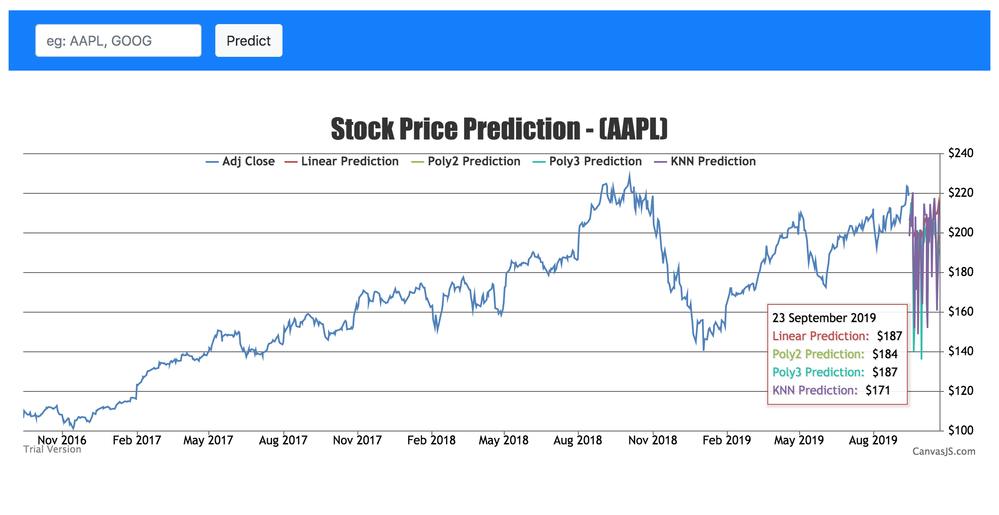

# Stock Price Prediction using ML 

Flask app, which predict stock price of any given company using Linear, Quadratic and KNN regression model

### Running locally

Make sure you have latest version of docker (Docker version 19.03.1) and docker-compose (docker-compose version 1.24.1)

    $ git clone https://github.com/ssawant/stock-analysis-webapp.git
    $ cd stock-analysis-webapp
    $ docker-compose up

Your app should be running on http://127.0.0.1:5000
